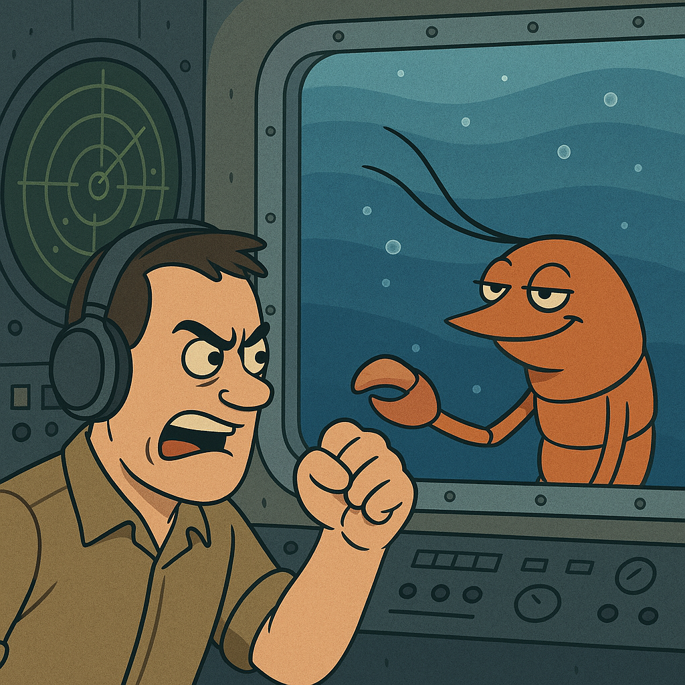

# Snapping Shrimp

A stochastic model for simulating the acoustic signature of snapping shrimp noise (SSN).

This project implements a physically-motivated model to generate time series of SSN. It captures the characteristic "bursty" and "heavy-tailed" nature of the noise by modelling snap timing (NHPP), individual waveforms, and amplitude (SαS distributions) based on environmental cycles. An interactive infographic visualises the model's components and final output.

Infographic: https://jjwakefield.github.io/snapping-shrimp/snapping_shrimp.html

## File Structure
- `snapping_shrimp.py`: The main Python script for the simulation.
- `snapping_shrimp.html`: The HTML file for the interactive infographic.
- `/assets`: Contains all the data files (.json, .wav) used by the infographic.
- `requirements.txt`: A list of the required Python packages for the simulation.

<i>Figure 1: A realistic representation of a snapping shrimp. Image generated using ChatGPT.</i>

